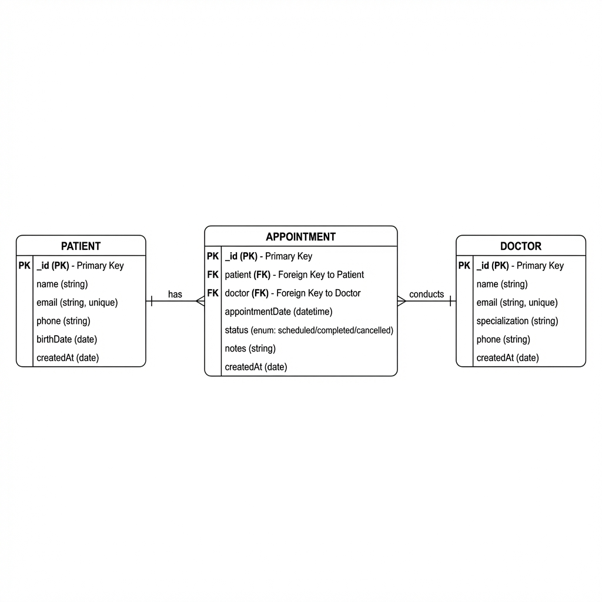

# Klinik Randevu Yönetim Sistemi API

Node.js (Express) ve MVC mimarisi ile geliştirilmiş RESTful API.

## 📋 Senaryo

Özel bir klinik için **randevu yönetim sistemi**. Hastalar doktorlardan randevu alabilir. Sistem iki önemli iş kuralı içerir:

1. **Tarihi geçmiş randevular silinemez** - Klinik kayıtlarının korunması
2. **Doktor aynı saatte birden fazla randevu alamaz** - Çakışma önleme

## 🏗️ Proje Yapısı (MVC)

```
sunucutabanli/
├── config/
│   └── db.js              # JSON veritabanı bağlantısı
├── controllers/
│   ├── patientController.js
│   ├── doctorController.js
│   └── appointmentController.js
├── models/
│   ├── Patient.js
│   ├── Doctor.js
│   └── Appointment.js
├── routes/
│   ├── patientRoutes.js
│   ├── doctorRoutes.js
│   └── appointmentRoutes.js
├── middlewares/
│   └── errorHandler.js
├── docs/
│   └── er-diagram.png
├── app.js
├── server.js
├── package.json
├── .env.example
├── database.json          # JSON veritabanı dosyası (otomatik oluşur)
└── README.md
```

## 🚀 Kurulum

### Gereksinimler
- Node.js (v14+)

### Adımlar

1. **Repository'yi klonlayın**
```bash
git clone <repository-url>
cd sunucutabanli
```

2. **Bağımlılıkları yükleyin**
```bash
npm install
```

3. **Environment dosyasını oluşturun**
```bash
cp .env.example .env
```

4. **Sunucuyu başlatın**
```bash
# Development (hot reload ile)
npm run dev

# Production
npm start
```

> 💡 **Not:** JSON dosya tabanlı veritabanı kullanılmaktadır. Harici bir veritabanı sunucusu gerektirmez. `database.json` dosyası otomatik olarak oluşturulur.

## 📡 API Endpoints

### Hastalar (Patients)

| Method | Endpoint | Açıklama |
|--------|----------|----------|
| GET | `/api/patients` | Tüm hastaları listele |
| GET | `/api/patients/:id` | Tek hasta getir |
| POST | `/api/patients` | Yeni hasta ekle |
| PUT | `/api/patients/:id` | Hasta güncelle |
| DELETE | `/api/patients/:id` | Hasta sil |

**Örnek Request Body (POST/PUT):**
```json
{
  "name": "Ahmet Yılmaz",
  "email": "ahmet@mail.com",
  "phone": "555-1234",
  "birthDate": "1990-05-15"
}
```

### Doktorlar (Doctors)

| Method | Endpoint | Açıklama |
|--------|----------|----------|
| GET | `/api/doctors` | Tüm doktorları listele |
| GET | `/api/doctors/:id` | Tek doktor getir |
| POST | `/api/doctors` | Yeni doktor ekle |
| PUT | `/api/doctors/:id` | Doktor güncelle |
| DELETE | `/api/doctors/:id` | Doktor sil |

**Örnek Request Body (POST/PUT):**
```json
{
  "name": "Dr. Ayşe Kaya",
  "email": "ayse.kaya@clinic.com",
  "specialization": "Dahiliye",
  "phone": "555-5678"
}
```

### Randevular (Appointments)

| Method | Endpoint | Açıklama |
|--------|----------|----------|
| GET | `/api/appointments` | Tüm randevuları listele |
| GET | `/api/appointments/:id` | Tek randevu getir |
| POST | `/api/appointments` | Yeni randevu oluştur |
| PUT | `/api/appointments/:id` | Randevu güncelle |
| DELETE | `/api/appointments/:id` | Randevu sil |

**Örnek Request Body (POST/PUT):**
```json
{
  "patientId": "hasta_id",
  "doctorId": "doktor_id",
  "appointmentDate": "2026-01-20T10:00:00Z",
  "notes": "Kontrol muayenesi"
}
```

## ⚠️ İş Kuralları

### 1. Tarihi Geçmiş Randevu Silinemez
```bash
# Bu istek 400 hatası döndürür
DELETE /api/appointments/:past_appointment_id

# Response:
{
  "success": false,
  "message": "Tarihi geçmiş randevular silinemez. Bu randevu klinik kayıtları için korunmalıdır."
}
```

### 2. Doktor Çakışma Kontrolü
```bash
# Aynı doktor, aynı saatte ikinci randevu - 400 hatası döner
POST /api/appointments

# Response:
{
  "success": false,
  "message": "Bu doktor seçilen tarih ve saatte başka bir randevuya sahip. Lütfen farklı bir zaman seçin."
}
```

## 📊 ER Diyagramı



```
┌─────────────┐     ┌──────────────────┐     ┌─────────────┐
│   PATIENT   │     │   APPOINTMENT    │     │   DOCTOR    │
├─────────────┤     ├──────────────────┤     ├─────────────┤
│ id (PK)     │     │ id (PK)          │     │ id (PK)     │
│ name        │────<│ patientId (FK)   │>────│ name        │
│ email (UK)  │     │ doctorId (FK)    │     │ email (UK)  │
│ phone       │     │ appointmentDate  │     │ specialization│
│ birthDate   │     │ status           │     │ phone       │
│ createdAt   │     │ notes            │     │ createdAt   │
└─────────────┘     │ createdAt        │     └─────────────┘
                    └──────────────────┘
```

## 🛠️ Teknolojiler

- **Runtime:** Node.js
- **Framework:** Express.js
- **Database:** JSON File (lowdb benzeri)
- **Architecture:** MVC (Model-View-Controller)

## 📝 Lisans

ISC
